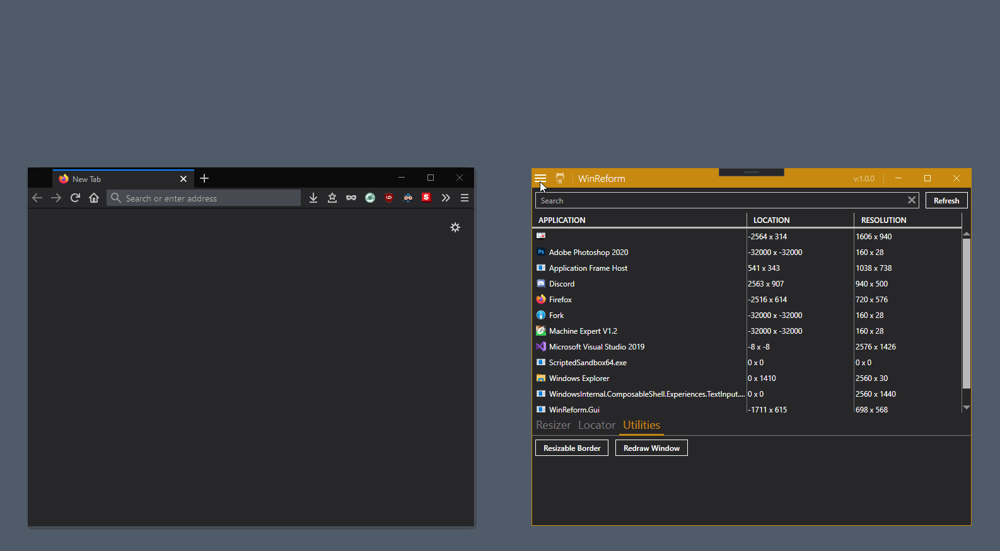
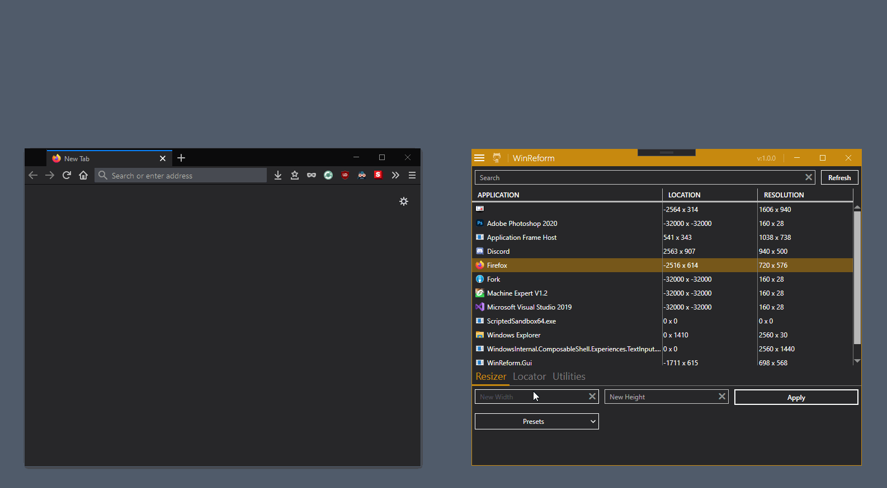
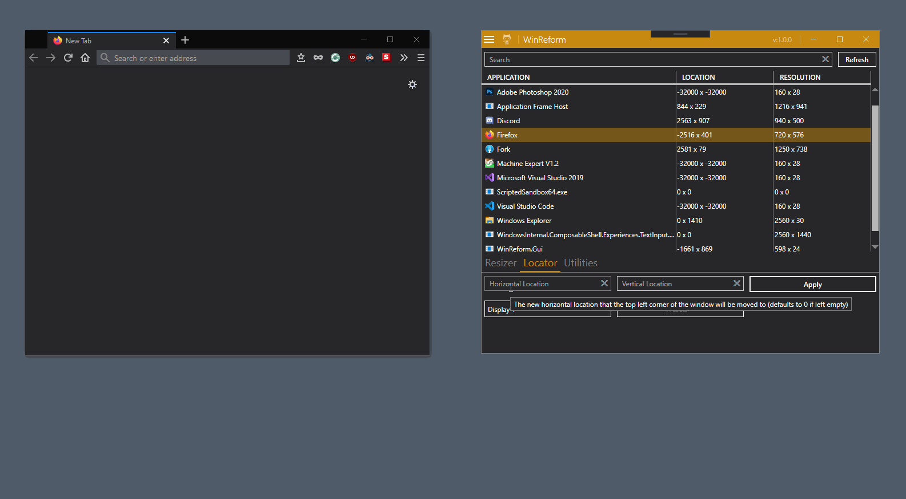

<!-- Markdown doesnt like aligning stuff -->

    
    <h1>WinReform</h1>
    

        A simple tool to help resize and relocate stubborn windows.
    

    <!-- Project Info Badges -->
    
    
     
    <!-- CD/CI Badges-->
    
    
    
     
    <!--Issues and Pull Request Badges -->
    
    
    
    
  </a>

## About
WinReform is a utility tool that exists to solve resolution issues with older applications.
Many old games/applications were not designed with today's bigger screens in mind. 
Often this results into extremely large or small windows with no possibility to resize them.

WinReform is here to help with these kind of applications. 
By utilizing the Windows API it allows for non resizable windows to be resized to your resolution of choice or move windows that have mysteriously disappeared outside of your screen bounds.
No matter the application, as long as it contains a window, WinReform will be able to help!

## Roll Call
This application wouldn't exist without the help of several amazing open source project that I love. If you like this app I recommend checking out the following.

 - [MahApps](https://github.com/MahApps/MahApps.Metro) which helped modernize the application by providing amazing tools and visuals.
 - [Autofac](https://github.com/autofac/Autofac) which helped manage all the dependencies that the application relied on.
 - [Moq](https://github.com/moq/moq4) which allowed for a simpler time writing tests by taking the mocking out of our hands.
 - [DotNet](https://github.com/dotnet/core) which provided the possibility to create this application to begin with.

## FAQ
**Is there a way to see the current window location?**
The settings allows you to change the PID column for a location column that shows the current location within the [virtual screen](https://docs.microsoft.com/en-us/windows/win32/gdi/the-virtual-screen).

**Why do some windows show a negative location?**
The coordinate position of a window is based on it's current location within the [virtual screen](https://docs.microsoft.com/en-us/windows/win32/gdi/the-virtual-screen). The zero point (0 x and y coordinate ) of the virtual space is based on the top left corner of the primary monitor.
windows located behind or above the zero point are assigned negative values.

**Why does my window resolution not match the monitor?**
Some windows might contain invisible border, drop shadows etc that are counted towards the resolution (full width and height of a window), this can cause resolutions that don't match a monitors exact resolution.

## License
WinReform is provided as-is under the Apache License Version 2.0. For more information see [LICENSE](./LICENSE.md).

## ShowRoom

